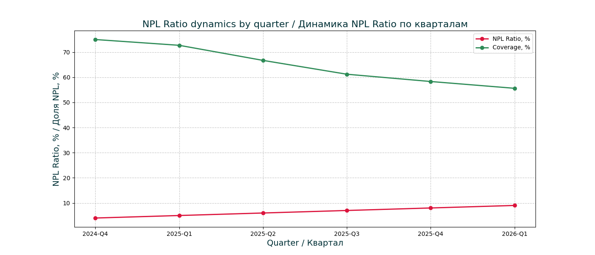
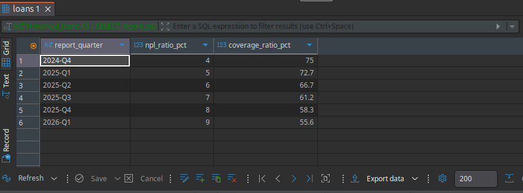

# NPL Ratio

Исследование финансовых вычислений и количественных формул, реализованное на Python, PostgreSQL, Microsoft Excel и прикладной математике. Текущая редакция посвящена показателю доли проблемных кредитов (NPL Ratio) и построена на едином цикле для каждой темы: рукописный конспект, расшифровка теории в Markdown, практическая задача с пошаговым решением, загрузчик данных на Python, Jupyter-ноутбук с графиком, эквивалент на SQL в нормализованной схеме PostgreSQL и Excel-модель для кросс-валидации.

A study of financial calculations and quantitative formulae, implemented through Python, PostgreSQL, Microsoft Excel, and applied mathematics. The current edition is dedicated to the NPL Ratio indicator and follows a single cycle for each topic: handwritten notes, transcribed theory in Markdown, a practical task with a step-by-step solution, a Python data loader, a Jupyter notebook with a chart, equivalent SQL on a normalised schema in PostgreSQL, and an Excel model for cross-validation.

Все данные и цифры в этой теме синтетические и созданы для демонстрации. Они не относятся к какой-либо реальной организации, банку или рыночным данным. Теоретические конспекты и решения задач представлены параллельно на английском и русском языках.

All datasets and figures in this topic are synthetic and created for demonstration. They do not represent any real organisation, bank, or market data. Theory notes and task solutions are provided in both English and Russian in parallel.

## Формула / Formula

```
NPL Ratio = (NPL / Кредитный портфель) × 100%
Coverage Ratio = (Резервы / NPL) × 100%
```

где:

NPL - сумма проблемных кредитов (просрочка 90 дней и более);
Кредитный портфель - совокупная задолженность по всем кредитам;
Резервы - резервы, сформированные под проблемные кредиты;
NPL Ratio - доля проблемных кредитов, %;
Coverage Ratio - покрытие проблемных кредитов резервами, %.

where:

NPL - the amount of non-performing loans (overdue by 90 days or more);
Loan portfolio - the total outstanding amount across all loans;
Provisions - reserves held against non-performing loans;
NPL Ratio - the share of non-performing loans, %;
Coverage Ratio - the coverage of non-performing loans by provisions, %.

NPL Ratio показывает, какая часть кредитного портфеля перестала работать, и служит индикатором качества портфеля и кредитного риска. Coverage Ratio дополняет его, показывая, насколько проблемные кредиты защищены резервами. Рассмотренные вместе в динамике, эти два показателя раскрывают не только размер риска, но и готовность банка его покрыть.

The NPL ratio shows what part of the loan portfolio has stopped performing and serves as an indicator of portfolio quality and credit risk. The coverage ratio complements it by showing how far non-performing loans are protected by provisions. Read together over time, these two indicators reveal not only the size of the risk but also the bank's readiness to cover it.

## Структура проекта / Project Structure

```
└── 2_npl/
    ├── 1_theory/                 Теория / Theory (RU + EN)
    │   └── npl_ratio.md
    │
    ├── 2_tasks/                  Задачи / Tasks (RU + EN)
    │   └── task_01_loan_portfolio.md
    │
    ├── 3_python/                 Загрузчик данных / Data loader
    │   └── npl.py
    │
    ├── 4_notebooks/              Jupyter-ноутбук / Jupyter notebook
    │   └── 1_npl_analysis.ipynb
    │
    ├── 5_PostgreSQL/
    │   ├── ddl.sql               Создание схемы / Schema script
    │   └── dml.sql               Аналитические запросы / Analytical queries
    │
    ├── data/                     Синтетические данные / Synthetic datasets (CSV)
    │   ├── clients.csv
    │   └── loans.csv
    │
    ├── excel/                    Excel-модель / Excel model
    │   └── NPL Ratio.xlsx
    │
    ├── docs/                     ERD-диаграмма и графики / ERD diagram and charts
    │   ├── 1_npl_erd.png
    │   └── 2_npl_ratio_by_quarters.png
    │
    ├── handwritten/              Рукописные конспекты / Handwritten notes
    │
    └── README.md
```

## Как запустить / How to Run

Склонировать репозиторий:

Clone the repository:

```bash
git clone https://github.com/diyorIsamukhamedov/A-Compendium-of-Financial-Calculations-and-Formulae.git
cd A-Compendium-of-Financial-Calculations-and-Formulae
```

Настроить виртуальное окружение Python:

Set up the Python environment:

```bash
python -m venv venv
source venv/bin/activate          # Linux / macOS
venv\Scripts\activate             # Windows
pip install -r requirements.txt
```

Создать схему и таблицы в DBeaver или psql:

Create the schema and tables in DBeaver or psql:

```bash
\i 2_npl/5_PostgreSQL/ddl.sql
```

Загрузить синтетические данные в базу:

Load the synthetic data into the database:

```bash
cd 2_npl/3_python
python npl.py
```

Открыть ноутбук:

Open the notebook:

```bash
jupyter notebook
```

Затем открыть `2_npl/4_notebooks/1_npl_analysis.ipynb`.

Then open `2_npl/4_notebooks/1_npl_analysis.ipynb`.



## Пример / Example

Расчёт NPL Ratio и Coverage Ratio по кварталам в `2_npl/5_PostgreSQL/dml.sql`:

NPL ratio and coverage ratio per quarter in `2_npl/5_PostgreSQL/dml.sql`:

```sql
WITH marked_loans AS (
    SELECT
        report_quarter,
        outstanding_amount,
        CASE WHEN days_overdue >= 90 THEN outstanding_amount ELSE 0 END AS npl_amount,
        CASE WHEN days_overdue >= 90 THEN provision_amount ELSE 0 END AS npl_provision
    FROM npl_ratio.loans
)
SELECT
    report_quarter,
    ROUND(SUM(npl_amount) / SUM(outstanding_amount) * 100, 1) AS npl_ratio_pct,
    ROUND(SUM(npl_provision) / NULLIF(SUM(npl_amount), 0) * 100, 1) AS coverage_ratio_pct
FROM marked_loans
GROUP BY report_quarter
ORDER BY report_quarter;
```

## Рукописные конспекты / Handwritten Notes

Оригинальные рукописные конспекты хранятся в `2_npl/handwritten/` в виде отсканированных изображений. Они отражают этап ручной проработки темы до её перевода в Markdown и в режим имплементации в кодовом (цифровом) виде.

Original handwritten notes are kept in `2_npl/handwritten/` as scanned images. They reflect the manual draft stage before transcription into Markdown.

## Технологии / Technologies

Python (Pandas, Matplotlib, Jupyter), PostgreSQL, Microsoft Excel, DBeaver, Git/GitHub, Markdown.

---

## Вывод / Conclusion

За шесть кварталов доля проблемных кредитов выросла с 4% до 9%, и портфель перешёл из зоны нормы в зону внимания. Одновременно покрытие резервами снизилось с 75% до 55,6%: резервы в абсолютном выражении росли, но их доля относительно проблемных кредитов падала, то есть NPL рос быстрее, чем банк успевал наращивать резервы. Это двойной сигнал риска - ухудшение качества портфеля при одновременном ослаблении защиты. Рекомендуемые меры: ужесточить кредитный скоринг, нарастить резервы и притормозить рост портфеля.

Over six quarters the share of non-performing loans rose from 4% to 9%, moving the portfolio from the normal zone into the watch zone. At the same time, reserve coverage fell from 75% to 55.6%: provisions grew in absolute terms, but their share relative to non-performing loans declined, meaning NPLs grew faster than the bank could build reserves. This is a double risk signal - deteriorating portfolio quality alongside weakening protection. The recommended actions are to tighten credit scoring, increase provisions, and slow portfolio growth.

## Автор / Author

[Diyor Isamuxamedov](https://github.com/diyorIsamukhamedov/)